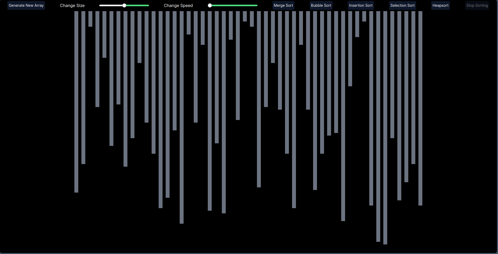

# Sorting Visualizer

Sorting Visualizer is a web application built with Next.js that provides a visual representation of various sorting algorithms. It includes features to generate new arrays, adjust array size, and control the sorting speed.

## Table of Contents

- [Features](#features)
- [Screenshots](#screenshots)
- [Installation](#installation)
- [Usage](#usage)
- [Contributing](#contributing)
- [License](#license)

## Features

- Generate new arrays of random values
- Visualize sorting algorithms: Merge Sort, Bubble Sort, Insertion Sort, Selection Sort
- Adjust array size with a slider
- Control sorting speed with a slider
- Disable controls during sorting to prevent interruptions

## Screenshots




## Installation

1. Clone the repository:

```bash
git clone https://github.com/yourusername/sorting-visualizer.git
cd sorting-visualizer
```

2. Install dependencies:

```bash
npm install
```

3. Run the development server:

```bash
npm run dev
```

4. Open your browser and navigate to `http://localhost:3000`.

## Usage

### Generate New Array

1. Use the "Generate New Array" button to create a new array of random values.
2. Adjust the size of the array using the "Change Size" slider.

### Adjust Sorting Speed

1. Use the "Change Speed" slider to control the speed of the sorting visualization.

### Start Sorting

1. Click on one of the sorting algorithm buttons (Merge Sort, Bubble Sort, Insertion Sort, Selection Sort) to start the sorting process.
2. The controls will be disabled during sorting to prevent any interruptions.

### Navbar Component

The `Navbar` component in this application controls various interactive elements, including array generation and sorting algorithm selection. The component accepts several props, such as `generateNewArray`, `handleMergeSort`, `handleBubbleSort`, `handleInsertionSort`, `handleSelectionSort`, `isSorting`, `delay`, and `setDelay`.

### Example

Here is an example of how the `Navbar` component is used in the `Home` component:

```javascript
import React, { useState } from 'react';
import Navbar from './Navbar';

const Home = () => {
  const [array, setArray] = useState<number[]>([]);
  const [isSorting, setIsSorting] = useState<boolean>(false);
  const [delay, setDelay] = useState<number>(10);

  const generateNewArray = (size: number) => {
    const newArray = Array.from({ length: size }, () => Math.floor(Math.random() * 100));
    setArray(newArray);
  };

  const handleMergeSort = () => { /* Merge sort logic */ };
  const handleBubbleSort = () => { /* Bubble sort logic */ };
  const handleInsertionSort = () => { /* Insertion sort logic */ };
  const handleSelectionSort = () => { /* Selection sort logic */ };

  return (
    <div>
      <Navbar
        generateNewArray={generateNewArray}
        handleMergeSort={handleMergeSort}
        handleBubbleSort={handleBubbleSort}
        handleInsertionSort={handleInsertionSort}
        handleSelectionSort={handleSelectionSort}
        isSorting={isSorting}
        setIsSorting={setIsSorting}
        delay={delay}
        setDelay={setDelay}
      />
      {/* Other components or UI elements */}
    </div>
  );
};

export default Home;
```

## Contributing

Contributions are welcome! Please open an issue or submit a pull request for any improvements or bug fixes.

1. Fork the repository.
2. Create a new branch (`git checkout -b feature/your-feature`).
3. Make your changes.
4. Commit your changes (`git commit -m 'Add some feature'`).
5. Push to the branch (`git push origin feature/your-feature`).
6. Open a pull request.

## License

This project is licensed under the MIT License. See the [LICENSE](LICENSE) file for details.

---

Feel free to replace the placeholder text and file paths with actual information relevant to your project.